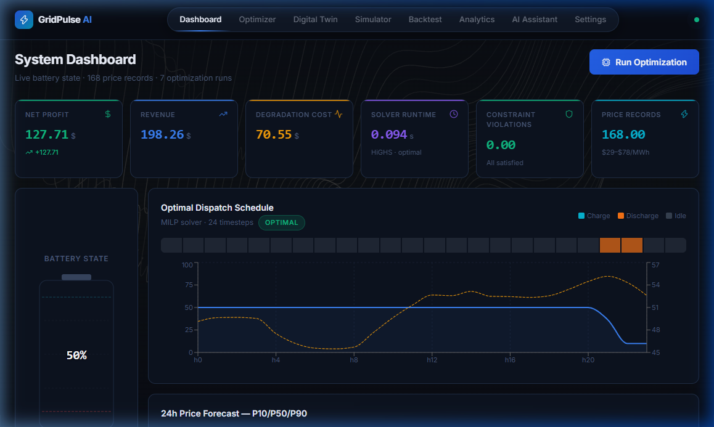
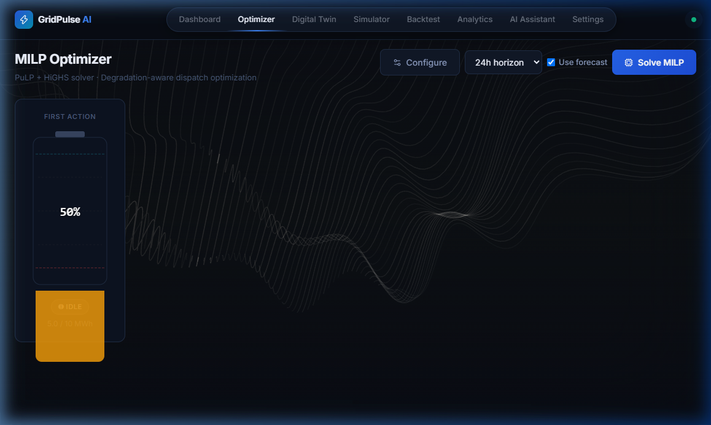
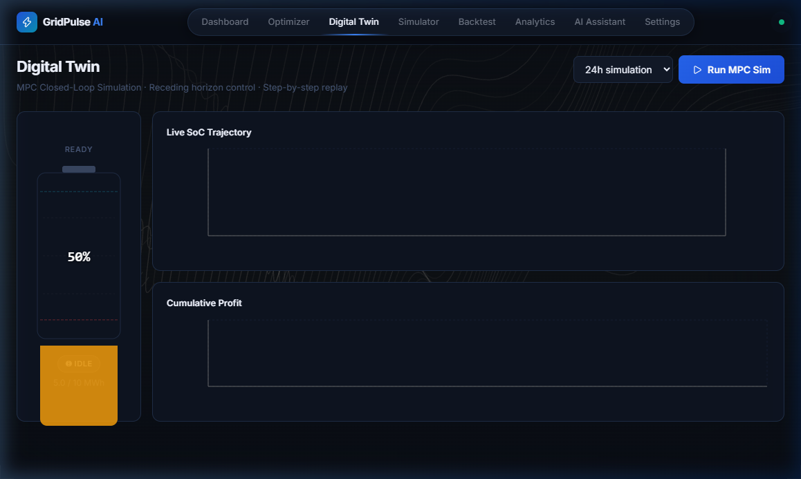
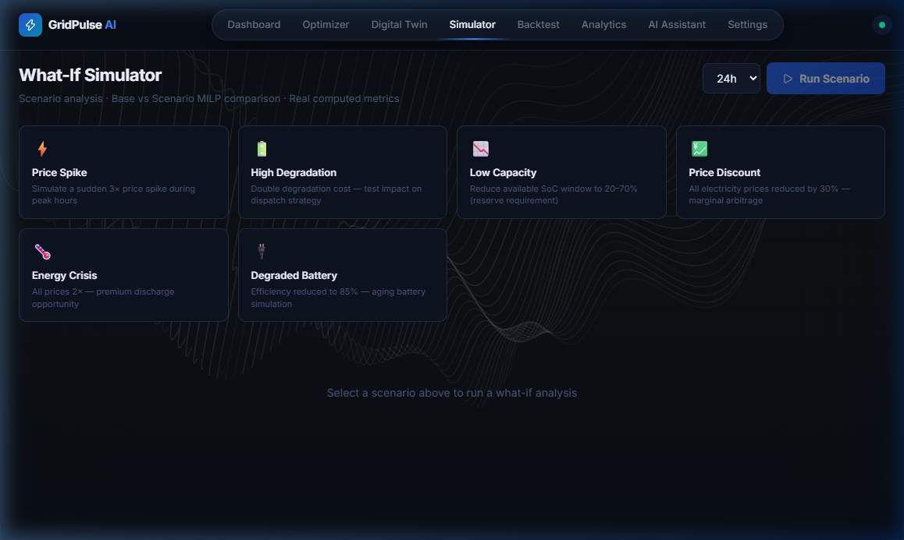
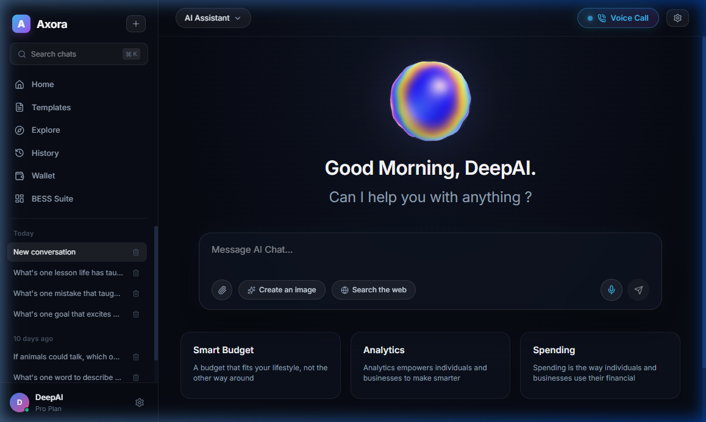
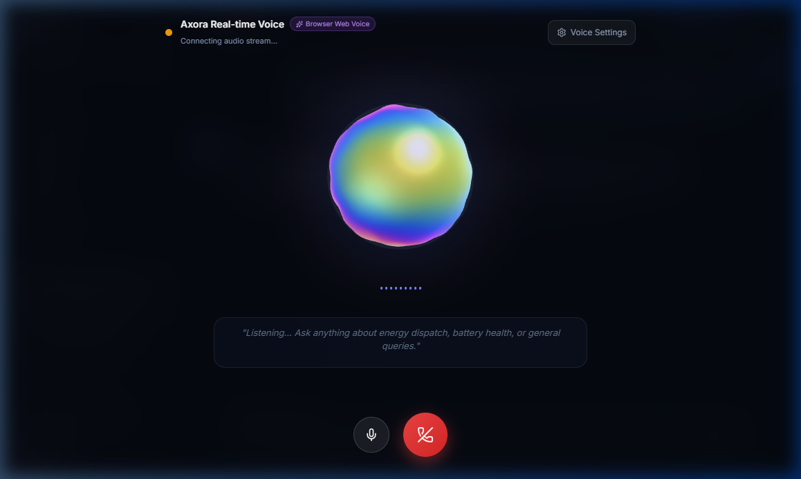
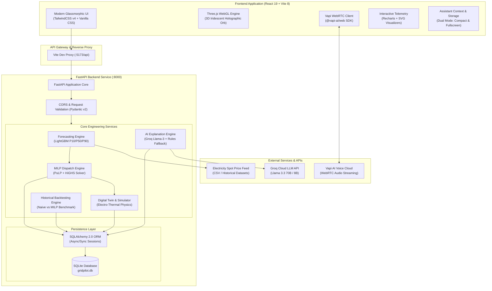
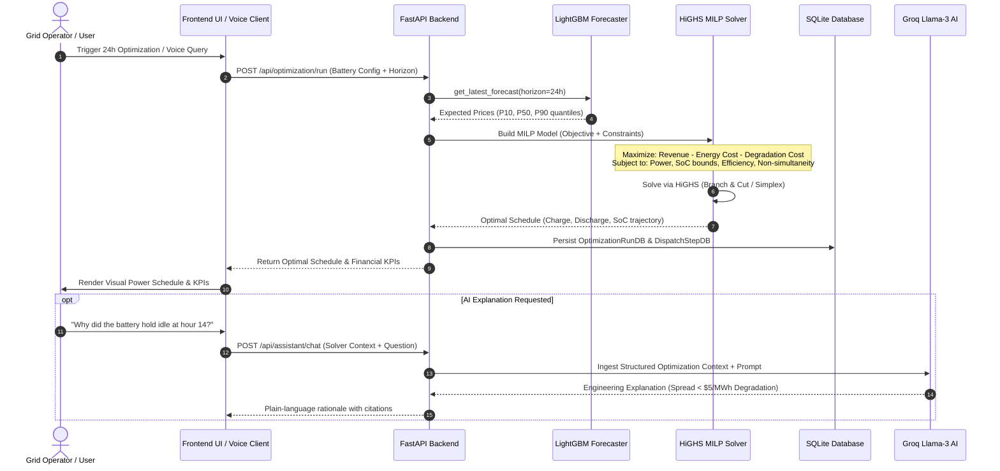
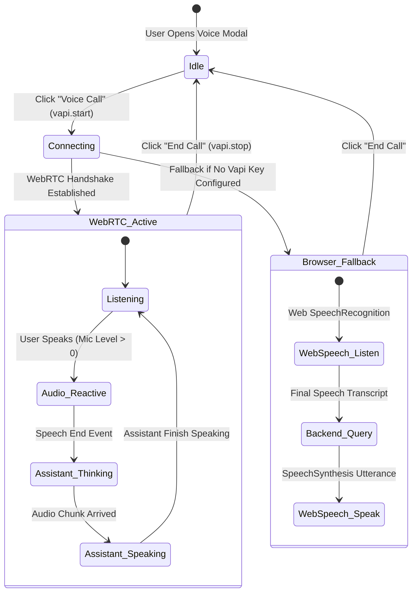

# ⚡ GridPulse AI (GridPilot AI)

<div align="center">



### **Degradation-Aware Intelligent Battery Arbitrage & Closed-Loop Control Platform**

[](https://python.org)
[](https://fastapi.tiangolo.com)
[](https://react.dev)
[](https://vitejs.dev)
[](https://threejs.org)
[](https://highs.dev)
[](https://vapi.ai)
[](LICENSE)

[**Live Demo**](http://localhost:5173) • [**API Docs**](http://localhost:8000/docs) • [**Architecture**](#-system-architecture) • [**Quickstart**](#-getting-started) • [**Mathematical Formulation**](#-mathematical-optimization-formulation)

</div>

---

## 📖 Table of Contents
1. [Overview & Value Proposition](#-overview--value-proposition)
2. [Platform Screenshots & Visual Walkthrough](#-platform-screenshots--visual-walkthrough)
3. [System Architecture](#-system-architecture)
4. [Mathematical Optimization Formulation](#-mathematical-optimization-formulation)
5. [Project Structure](#-project-structure)
6. [API Endpoints Reference](#-api-endpoints-reference)
7. [Getting Started (Step-by-Step)](#-getting-started)
8. [Configuration & Environment Variables](#-configuration--environment-variables)
9. [AI Assistant & Real-Time Voice Chat](#-ai-assistant--real-time-voice-chat)
10. [Verification & Testing](#-verification--testing)
11. [License](#-license)

---

## 🌟 Overview & Value Proposition

Wholesale electricity markets exhibit extreme volatility. Large-scale **Battery Energy Storage Systems (BESS)** can generate significant returns by charging during price troughs (e.g. surplus midday solar) and discharging during evening peak demand.

### The "Degradation Trap" of Naive Systems
Standard energy arbitrage models follow a naive heuristic: *"Charge whenever price is low, discharge whenever price is high."* 

However, **lithium-ion cells physically degrade on every cycle** (solid electrolyte interphase layer growth, lithium plating, and active material loss). If a battery cycles aggressively to capture small price spreads ($2–$4/MWh), **cell degradation costs ($5.00+/MWh) rapidly exceed gross profits**, destroying multimillion-dollar battery assets years ahead of schedule.

### The GridPulse-AI Solution
GridPulse-AI bridges physical electrochemistry and financial dispatch:
- **ML Price Forecasting**: LightGBM probabilistic forecasting (P10, P50, P90 quantile bounds) 24–48 hours ahead.
- **Degradation-Aware MILP**: Mixed-Integer Linear Programming via the **HiGHS** solver that rigorously factors in degradation penalties ($\$/\text{MWh}$), C-rate limits, and non-linear round-trip efficiencies.
- **BESS Digital Twin**: High-fidelity cell rack telemetry, State of Health (SoH) tracking, and equivalent full cycle (EFC) counting.
- **Stress-Testing Simulator & Historical Backtesting**: Simulates extreme grid events (500% price spikes, renewable curtailment, blackouts) and validates revenue gains against historical grid data.
- **Axora AI Copilot with Real-Time Vapi Voice**: Natural voice and text interface powered by Groq Llama-3 that explains solver dispatch rationales in plain language without overriding mathematical safety bounds.

---

## 📸 Platform Screenshots & Visual Walkthrough

### 1. Executive Mission Control Dashboard
Real-time battery State of Charge gauge, active power flow telemetry, today's gross revenue vs cell degradation cost breakdown, and recent optimization runs.


---

### 2. Degradation-Aware MILP Optimizer
Interactive 24-hour dispatch optimizer with hourly charging/discharging power curves, price spread overlay, net profit calculations, and physical constraint status.



---

### 3. Electro-Thermal BESS Digital Twin
Physical cell rack monitoring, state of health (SoH) capacity fade retention, temperature heatmaps, and cycle degradation progression over multi-year asset lifespans.



---

### 4. Grid Simulator & Stress Testing
Simulate extreme real-world operating conditions: sudden price spikes, renewable curtailment, blackouts, frequency response reserves, and degraded cell efficiencies.



---

### 5. Axora AI Assistant with 3D Iridescent Orb
Sleek dark-mode assistant featuring an interactive, audio-reactive 3D iridescent holographic orb rendered via Three.js shaders. Supports one-click smart suggestion cards, file attachments, web search, and generative cards.



---

### 6. Real-Time Conversational Voice Chat (Vapi WebRTC)
Bidirectional, ultra-low latency conversational voice streaming powered by the official `@vapi-ai/web` SDK. Features dynamic audio equalizer waveforms, live transcription captions, and audio-reactive orb pulsation.



---

## 🏛️ System Architecture

### High-Level Architecture Diagram



---

### Data Flow & Optimization Pipeline



---

### Real-Time Voice Streaming Workflow (Vapi + Three.js)



---

## 📐 Mathematical Optimization Formulation

The core dispatch scheduler is modeled as a discrete-time **Mixed-Integer Linear Program (MILP)** over a time horizon $T = \{1, 2, \dots, N\}$ (typically $N = 24$ hours, $\Delta t = 1.0\text{ h}$):

### 1. Objective Function
$$\max_{\substack{P^{\text{ch}}_t, P^{\text{dis}}_t, \\ u_t, v_t, E_t}} \sum_{t=1}^{T} \left( \lambda_t \cdot P^{\text{dis}}_t \cdot \Delta t - \lambda_t \cdot P^{\text{ch}}_t \cdot \Delta t - C_{\text{deg}} \cdot (P^{\text{ch}}_t + P^{\text{dis}}_t) \cdot \Delta t \right) + \beta \cdot \frac{E_T - E_{\text{target}}}{E_{\text{cap}}}$$

Where:
* $\lambda_t$: Electricity market spot price at timestep $t$ ($\$/\text{MWh}$).
* $P^{\text{ch}}_t$: Charging power (MW).
* $P^{\text{dis}}_t$: Discharging power (MW).
* $C_{\text{deg}}$: Degradation penalty factor ($\$/\text{MWh}$ throughput), default $\$5.00/\text{MWh}$.
* $E_t$: Energy stored in the battery at hour $t$ (MWh).
* $\beta$: Terminal state value weight to prevent end-of-horizon battery depletion.

### 2. Constraints

#### Power Limits & Non-Simultaneous Operation:
$$0 \le P^{\text{ch}}_t \le P^{\text{max}} \cdot u_t \quad \forall t \in T$$
$$0 \le P^{\text{dis}}_t \le P^{\text{max}} \cdot v_t \quad \forall t \in T$$
$$u_t + v_t \le 1, \quad u_t, v_t \in \{0, 1\} \quad \forall t \in T$$

#### Energy Conservation & State of Charge (SoC):
$$E_t = E_{t-1} + \left( P^{\text{ch}}_t \cdot \eta_{\text{ch}} - \frac{P^{\text{dis}}_t}{\eta_{\text{dis}}} \right) \cdot \Delta t \quad \forall t \in T$$
$$\text{SoC}_t = \frac{E_t}{E_{\text{cap}}}$$
$$\max(\text{SoC}_{\min}, \text{Reserve}) \le \text{SoC}_t \le \text{SoC}_{\max} \quad \forall t \in T$$

#### Boundary Conditions:
$$E_0 = E_{\text{cap}} \cdot \text{SoC}_{\text{initial}}$$
$$E_T \ge E_{\text{cap}} \cdot \text{SoC}_{\text{target}} \quad (\text{optional terminal constraint})$$

---

## 📁 Project Structure

```
GridPulse-AI/
├── docs/
│   └── images/                       # High-resolution screenshots for documentation
│       ├── dashboard.png             # Mission control dashboard
│       ├── optimizer.png             # MILP optimizer UI
│       ├── digital_twin.png          # Electro-thermal cell rack monitoring
│       ├── simulator.png             # Stress-testing grid simulator
│       ├── assistant_hero.png        # Axora AI Assistant & 3D Orb
│       └── voice_call.png            # Real-time Vapi voice session modal
│
├── backend/                          # FastAPI Backend Engine
│   ├── app/
│   │   ├── api/                      # REST API Route Controllers
│   │   │   ├── analytics.py          # Revenue & degradation KPI summaries
│   │   │   ├── assistant.py          # AI Explanation & Groq LLM endpoint
│   │   │   ├── backtest.py           # Historical backtesting endpoints
│   │   │   ├── battery.py            # Battery configuration & specs CRUD
│   │   │   ├── forecast.py           # 24h/48h ML electricity price forecasts
│   │   │   ├── optimization.py       # MILP dispatch run execution & results
│   │   │   ├── prices.py             # Historical spot electricity price feeds
│   │   │   └── simulation.py         # Digital twin scenario stress-testing
│   │   ├── core/
│   │   │   └── config.py             # Pydantic Settings & environment variables
│   │   ├── database/
│   │   │   └── database.py           # SQLAlchemy database schema & session factory
│   │   ├── forecasting/
│   │   │   ├── feature_engineering.py# Lags, moving averages & calendar features
│   │   │   ├── inference.py          # LightGBM model inference pipeline
│   │   │   └── training.py           # LightGBM quantile regression training
│   │   ├── models/                   # Pydantic Schemas & Data Transfer Objects
│   │   │   ├── analytics.py
│   │   │   ├── battery.py
│   │   │   ├── forecast.py
│   │   │   └── optimization.py
│   │   ├── optimization/
│   │   │   └── milp.py               # PuLP + HiGHS Mixed Integer Linear Program
│   │   ├── services/
│   │   │   ├── groq_service.py       # Groq Cloud Llama-3 assistant integration
│   │   │   ├── optimization_service.py# Dispatch coordinator & data transformations
│   │   │   └── simulation_service.py # Digital twin electro-thermal physics model
│   │   └── main.py                   # FastAPI Application Entrypoint & Startup
│   ├── data/
│   │   └── sample_prices.csv         # 168-hour sample wholesale electricity prices
│   ├── .env.example                  # Backend environment variables template
│   ├── generate_sample_data.py       # Synthetic market price dataset generator
│   ├── gridpilot.db                  # Local SQLite database
│   ├── init_db.py                    # Database seeding & precomputed baseline run
│   └── requirements.txt              # Python package dependencies
│
└── frontend/                         # React 19 + Vite 8 Web Application
    ├── public/                       # Static public assets & fonts
    ├── src/
    │   ├── components/               # Reusable UI & Visualization Components
    │   │   ├── assistant/
    │   │   │   ├── AssistantConstants.ts       # Model definitions, prompt templates & cards
    │   │   │   ├── AssistantSettingsModal.tsx  # Vapi API key & Groq credentials config
    │   │   │   ├── AssistantTemplatesModal.tsx # Pre-engineered prompt templates drawer
    │   │   │   ├── ChatMessageItem.tsx         # Message bubble with copy, TTS & feedback
    │   │   │   ├── IridescentOrb.tsx           # Three.js 3D Iridescent Holographic Orb
    │   │   │   └── VoiceCallModal.tsx          # Real-time WebRTC Voice Call modal
    │   │   ├── ui/                   # Micro-animation UI primitives
    │   │   ├── BatteryVisualization.tsx # Animated SVG BESS cell rack visualizer
    │   │   ├── DataFieldBackground.tsx  # Ambient reactive background particles
    │   │   ├── Preloader.tsx            # Initial asset loading splash screen
    │   │   └── SpotlightNavbar.tsx      # Sleek floating spotlight navigation bar
    │   ├── context/
    │   │   └── AssistantContext.tsx  # Global assistant state (Compact vs Fullscreen)
    │   ├── pages/                    # Platform Views / Routes
    │   │   ├── Analytics.tsx         # Detailed financial & operational telemetry
    │   │   ├── Assistant.tsx         # Axora AI Assistant & Copilot interface
    │   │   ├── Backtest.tsx          # Historical strategy comparison
    │   │   ├── Dashboard.tsx         # Live telemetry & executive KPI cards
    │   │   ├── DigitalTwin.tsx       # BESS physical degradation & thermal monitoring
    │   │   ├── Landing.tsx           # Product overview landing page
    │   │   ├── Optimizer.tsx         # Interactive 24-hour MILP dispatch schedule
    │   │   ├── Settings.tsx          # Battery hardware parameters configuration
    │   │   └── Simulator.tsx         # Extreme event grid stress-testing
    │   ├── services/
    │   │   ├── api.ts                # Axios backend REST API client
    │   │   ├── chatStorage.ts        # LocalStorage session manager (Today, 10 days ago)
    │   │   └── vapiService.ts        # Vapi Web SDK wrapper & Web Speech fallback
    │   ├── types/
    │   │   └── index.ts              # TypeScript interfaces for API payloads
    │   ├── App.css                   # Custom utility animations
    │   ├── App.tsx                   # Top-level routing & layout integration
    │   ├── index.css                 # Modern CSS design tokens & typography
    │   └── main.tsx                  # React DOM client entrypoint
    ├── package.json                  # NPM packages & scripts
    ├── tsconfig.json                 # TypeScript compiler configuration
    └── vite.config.ts                # Vite 8 config with Tailwind v4 & API proxy
```

---

## 🔌 API Endpoints Reference

The backend provides complete interactive Swagger documentation at `http://localhost:8000/docs`.

| Method | Endpoint | Description |
| :--- | :--- | :--- |
| `GET` | `/api/health` | Health check, version, and Groq configuration status |
| `GET` | `/api/battery` | Retrieve active BESS hardware specifications |
| `PUT` | `/api/battery` | Update capacity ($MWh$), power ($MW$), efficiencies, and degradation cost |
| `GET` | `/api/prices/latest` | Retrieve recent electricity price series |
| `GET` | `/api/forecast/latest` | Retrieve latest 24h probabilistic price forecast (P10/P50/P90) |
| `POST`| `/api/forecast/train` | Retrain LightGBM forecasting models on updated price data |
| `POST`| `/api/optimization/run` | Execute 24-hour HiGHS MILP optimization run |
| `GET` | `/api/optimization/latest` | Retrieve the most recent optimal dispatch schedule |
| `POST`| `/api/simulation/run` | Run stress-testing digital twin scenario (price spikes, reserve calls) |
| `POST`| `/api/backtest/run` | Execute historical backtest comparing naive vs MILP dispatch |
| `GET` | `/api/analytics/summary` | Retrieve aggregate financial and degradation performance metrics |
| `POST`| `/api/assistant/chat` | Groq Llama-3 AI explanation engine with solver context ingestion |

---

## 🚀 Getting Started

### 1. Clone the Repository
```bash
git clone https://github.com/KrishnaNsingh/GridPulse-AI.git
cd GridPulse-AI
```

### 2. Backend Setup & Startup

#### On Windows (PowerShell):
```powershell
cd backend

# Create & activate Python virtual environment
python -m venv venv
.\venv\Scripts\Activate.ps1

# Install requirements + HiGHS mathematical solver
pip install -r requirements.txt
pip install highspy

# Setup environment variables
Copy-Item .env.example .env

# Initialize database, load sample datasets & compute baseline run
python init_db.py

# Start FastAPI server
python -m uvicorn app.main:app --host 127.0.0.1 --port 8000 --reload
```

#### On macOS / Linux (Bash):
```bash
cd backend

python3 -m venv venv
source venv/bin/activate

pip install -r requirements.txt
pip install highspy

cp .env.example .env
python init_db.py

uvicorn app.main:app --host 127.0.0.1 --port 8000 --reload
```

* Backend will be available at: **[http://localhost:8000](http://localhost:8000)**
* Swagger API Documentation: **[http://localhost:8000/docs](http://localhost:8000/docs)**

---

### 3. Frontend Setup & Startup

Open a **second terminal** window:

```bash
cd frontend

# Install dependencies (including Three.js, Lucide, and @vapi-ai/web)
npm install

# Start Vite development server
npm run dev
```

* Frontend UI will be available at: **[http://localhost:5173](http://localhost:5173)**

---

## ⚙️ Configuration & Environment Variables

### Backend (`backend/.env`)
Create a `.env` file in the `backend/` folder (or copy `.env.example`):

```ini
# Optional: Groq API key for full Llama-3 natural language explanations
GROQ_API_KEY=your_groq_api_key_here
GROQ_MODEL=llama3-8b-8192

# Database URL (SQLite default)
DATABASE_URL=sqlite:///./gridpilot.db

# CORS Allowed Origins
CORS_ORIGINS=http://localhost:5173,http://localhost:3000

# Application Environment & Log Level
APP_ENV=development
LOG_LEVEL=INFO
```
*(Note: If no Groq key is provided, the backend seamlessly runs in rule-based fallback mode without failing).*

### Voice & Vapi Keys (`frontend`)
You can configure your Vapi credentials directly in the UI:
1. Open the assistant and click the **Settings** gear icon.
2. Enter your **Vapi Public Key** and **Vapi Assistant ID** (saved safely in browser `localStorage`).
3. *(Zero-config Fallback)*: If no Vapi key is provided, voice mode automatically runs using the browser's built-in **Web Speech API**, allowing immediate voice testing with zero setup!

---

## 🎙️ AI Assistant & Real-Time Voice Chat

The **Axora AI Assistant** provides dual-mode intelligence:

| Mode | Visual & Operational Behavior |
| :--- | :--- |
| **Compact Side Panel ("Small Portion")** | Slides out smoothly from the right side of any dashboard page (`width: 460px`). Allows monitoring real-time grid telemetry while chatting or making voice queries. Features a **Maximize** button (`⛶`) and **Close** button (`✕`). |
| **Fullscreen Expansive Workspace** | Maximizes to full screen with a complete sidebar featuring chat sessions grouped by date (**Today**, **Yesterday**, **10 days ago**), large 3D iridescent orb, and suggestion cards. Features a **Minimize** button (`🗗`) to return to the side panel. |

### Key Assistant Capabilities:
- **Audio-Reactive 3D Holographic Orb**: Shaders dynamically deform and ripple in real time based on speech audio frequency.
- **Degradation Reasoning**: Explains *why* the optimizer decided to charge, discharge, or hold idle at any hour.
- **Web Search Citations**: Live market intelligence queries citing current global electricity trends.
- **Generative Concept Art**: Visual prompt card rendering for energy facilities and grid assets.
- **Bidirectional Voice Streaming**: Low-latency speech recognition and synthesis via Vapi WebRTC.

---

## 🧪 Verification & Testing

### Running Backend Unit & Solver Tests:
```bash
cd backend
.\venv\Scripts\pytest -v
```

### Validating Frontend TypeScript & Production Build:
```bash
cd frontend
npm run build
```

---

## 📄 License

This project is licensed under the **MIT License** — see the [LICENSE](LICENSE) file for details.

---

<div align="center">
  <sub>Built with ❤️ for intelligent, sustainable, and degradation-aware renewable grid energy storage.</sub>
</div>
